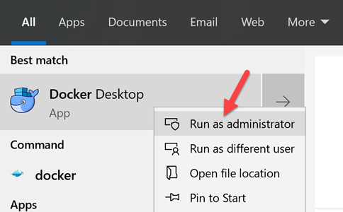
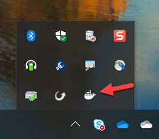

# Run an Angular app on Docker for Win in 10 Steps
This is a simple example on how to create and run an Angular project on a docker container using Docker Desktop for Windows.  
All though this may work on MacOS, it was only tested on Windows 10.

### Let's get started

1. First, install [Docker Desktop](https://www.docker.com/products/docker-desktop).
<br/><br/>
2. Run Docker as administrator.  

<br/><br/><br/>
3. Configure Shared Drives on Docker  
Once docker is running, find the docker icon on system tray, right click then click Settings.  
In the Shared Drive section, share the drive where your code will be located on Windows.

<br/><br/><br/>
4. Now that Docker is configured, lets create the docker file. Name it Dockerfile.
```Dockerfile
FROM node:12-alpine

ENV HOME=/usr/src/app
RUN mkdir -p $HOME
WORKDIR $HOME

RUN yarn global add @angular/cli

EXPOSE 4200

USER 1000
```
<br/><br/>
5. We also need to create the docker compose files.  
Name it docker-compose.yml
```
node:
    build: .
    ports:
        - "4200:4200"
    volumes:
        - .:/usr/src/app
    command: yarn run start
```
<br/><br/>
6. Build the image.  
Docker will use the information the Dockerfile to create it.  
Execute the following command with administrator privileges:
```
docker-compose build
```
<br/><br/>
7. Now that we have our image ready, lets execute the command to create the Angular project.
```
docker-compose run --rm node ng new --directory=./  --skip-install my-app-name
```
&nbsp;&nbsp;&nbsp;&nbsp;&nbsp;&nbsp;Note that the Angular project files will be created in the folder you are running the command.
<br/><br/><br/>
8. Next, lets install all depencies for your Angular project.
```
docker-compose run --rm node yarn
```
<br/><br/>
9. Before we start our container, we need to adjust the package.json file.  
Update the start script as below:
```
"start": "ng serve --host 0.0.0.0",
```
<br/><br/>
10. Let's start the container
```
Docker-compose up
```
<br/><br/>
### Voila!
Open [http://localhost:4200](http://localhost:4200) to check the Angular app.  
<br/><br/>   
## Additional information

#### Rebuild on change doesn't work and workaround
Its worth note that Docker for Windows doesn't support change notifications on the mounted volume.  
That means that when you change a file on your project, it will not automatically rebuild.  
More information can be found on:
* [Github issue](https://github.com/docker/for-win/issues/56)
* [Docker Logs and troubleshooting - INOTIFY ON SHARED DRIVES DOES NOT WORK](https://docs.docker.com/docker-for-windows/troubleshoot/#/inotify-on-shared-drives-does-not-work)  
As a workaround, you can install a script called [docker-volume-watcher](https://github.com/merofeev/docker-windows-volume-watcher) to solve that problem.

#### File examples
You can find example of the docker and docker compose files [here](./examples).
